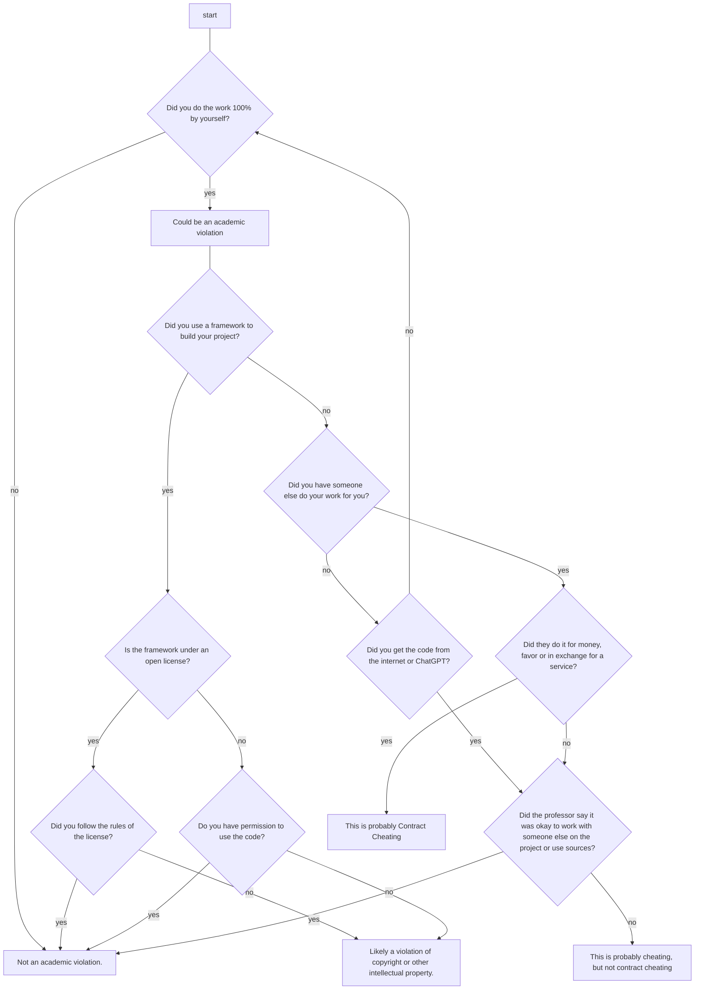

# Contract Cheating in Computer Science

## Introduction

Contract cheating occurs when a student uses the efforts of some third party to complete an assignment,
test, or examination. The third party may perform this service either as a favor (such as a friend writing an assignment), for money (a essay writing service), or some other exchange (e.g. a student who is good at math offers to do an assignment in exchange for having an English essay written for them).

## Example Scenario

Seo-joon has no experience in Java and finds he is falling behind in his assignments which are taking up a lot of time and getting in the way of his database classes where he is doing well. In his Database class, another student, Anderson, asks him if he would write his next database assignment for him. Seo-joon agrees to write the database assignment on one condition -- Anderson must do his next Java assignment.

Both Seo-joon and Anderson submit the assignments, but while Anderson got an 88% on his database assignment, Seo-joon got an even worse mark than usual on his. For the first three weeks, Seo-joon was annoyed that Anderson did well. However, Seo-joon and Anderson's professor reviewed their assignments and noticed that Anderson's answer looked very similar to Seo-joon. He called them both into his office. Now, not only did Seo-joon not succeed in achieving his academic goals, he now faces getting a zero on both assignments and being written up for contract cheating on his academic record.

## The Dangers of Contract Cheating

Like all academic integrity violations, contract cheating is dishonest and unethical. However, it is also quite dangerous. In the above case, Anderson was interested in a simple exchange of favors, however, what if he offered to do the assignment for a payment?

In that case, a low mark might have convinced Seo-joon to say he is not paying anymore for the service. However, Anderson has the upper hand because if Seo-joon refuses to pay, Anderson can threaten to go to his professor. In fact, Seo-joon's cheating puts him in a vulnerable position because Anderson can threaten to disclose the cheating whenever he wants to with almost no recourse available to Seo-joon to protect himself.

## How do I know if it's contract cheating?

## Further Reading

- Lancaster, Thomas, and Robert Clarke. "The phenomena of contract cheating." In Student plagiarism in an online world: Problems and solutions, pp. 144-159. IGI Global, 2008.